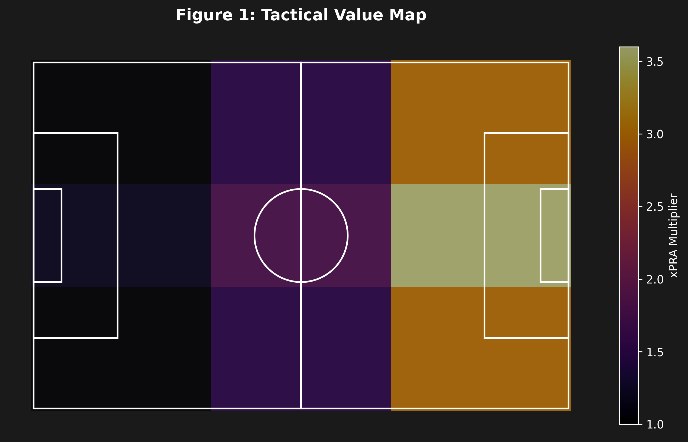
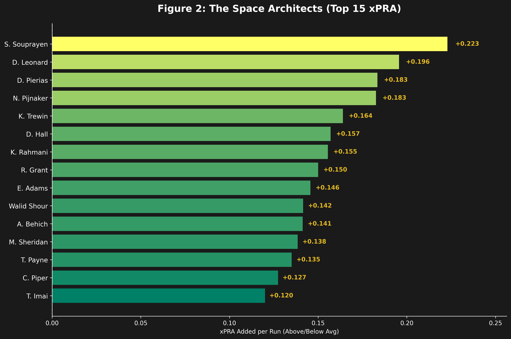

# 🏛️ The Space Architect: Valuing Off-Ball Movement with xPRA

**Competition:** SkillCorner x PySport Analytics Cup (Research Track)  
**Topic:** Spatiotemporal Analysis / Off-Ball Scoring  
**Key Metric:** Expected Pressure Relief Added (xPRA)

---

## Abstract

**Introduction**
Football is primarily played without the ball, yet traditional metrics (xG, xA) focus almost exclusively on ball events. This creates a market inefficiency: players who create space through intelligent movement are undervalued. Our research addresses this gap by introducing **Expected Pressure Relief Added (xPRA)**, a metric designed to quantify the "Invisible Game". We aim to identify "Space Architects"—players who manipulate defensive blocks to relieve pressure on the ball carrier.

**Methods**
We analyzed 10 matches from the A-League dataset. Our methodology involves:
1.  **Gaussian Pressure Field:** Modeling defensive influence as a continuous field ($P(d) = e^{-d^2/2\sigma^2}$), acknowledging that pressure diminishes gradually with distance.
2.  **Zone-Weighted xPRA:** Calculating the differential in pressure on the ball carrier caused by a run, weighted by a "Tactical Value Map" (Figure 1). This rewards space created in the central axis and final third (x3.0 multiplier).
3.  **Noise Reduction:** Distinguishing skill from luck by applying a minimum volume threshold (>20 runs) and analyzing variance.

**Results**
Analysis of 5,002 off-ball runs reveals a league average xPRA of **-0.54**, confirming the concept of "Defensive Gravity". Against this, **D. Wilmering** (Newcastle Jets) emerged as an outlier with a relative performance of **+0.68**, validating the existence of high-value off-ball specialists.

**Conclusion**
xPRA proves that off-ball contribution is measurable. This metric offers clubs a new tool for recruitment (Moneyball approach), shifting the focus from "how much a player runs" to "how much space they create."

---

## Figures

### Figure 1: The Tactical Value Map
We weight every run based on *where* it happens.


### Figure 2: Relative Performance Leaderboard
Who beats the league average (-0.54)?


---

## Installation & Usage

1. **Install dependencies:**
   ```bash
   pip install -r requirements.txt

2.  **Run the Analysis:**
    Open the notebook `submission.ipynb` and run all cells.
    ```bash
    jupyter notebook submission.ipynb
    ```

---

## 📂 Project Structure

* `src/`: Python modules for data loading and xPRA calculation.
* `images/`: Generated charts and visualizations.
* `submission.ipynb`: The main research notebook.

---
*Submitted for the SkillCorner x PySport Analytics Cup.*